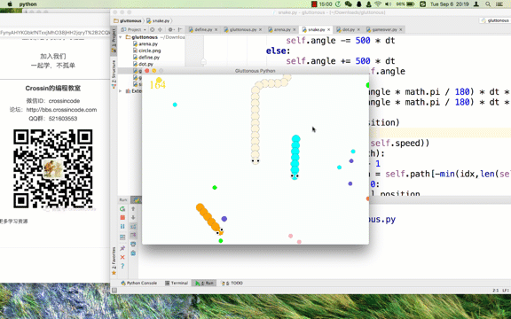

# 贪吃蛇大作战 - AI遗传算法实现

   

> 这是一个通过遗传算法实现的贪吃蛇大作战的AI，贪吃蛇大作战不同于普通的贪吃蛇，他要做的是避开其他蛇的情况下，最快地吃到食物，所以这是普通的A*算法等寻路算法难以实现的，于是，我和ajacker提出了针对贪吃蛇大作战，贪吃蛇的行为算法，并通过遗传算法对参数进行调整，最终得到最强蛇。我们为了节省开发周期，我们基于一个crossin的开源项目`gluttonous`开发AI。最终，我们的蛇远超出原项目中传统规则匹配的AI蛇。

## Content

主要的变动在这些文件中:

- snake.py
- Evolution.py
- dot.py

## Algorithm

我们主要设计了蛇的行为算法，并且将蛇的行为算法编码为基因，并设计了适应度函数，从而使该蛇越来越流弊。

---

game of gluttonous python（仿制《贪吃蛇大作战》）

Powered by cocos2d

`pip install cocos2d`

演示：

[点击打开视频](http://v.qq.com/iframe/player.html?vid=f1309ieuz4y&width=670&height=502.5&auto=0)

知乎：[Crossin](https://www.zhihu.com/people/crossin)

微信公众号：Crossin的编程教室（crossincode）

